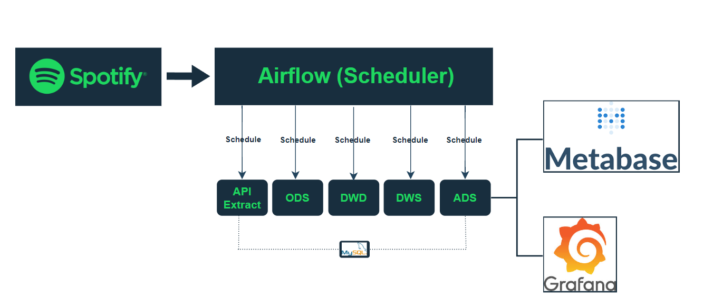
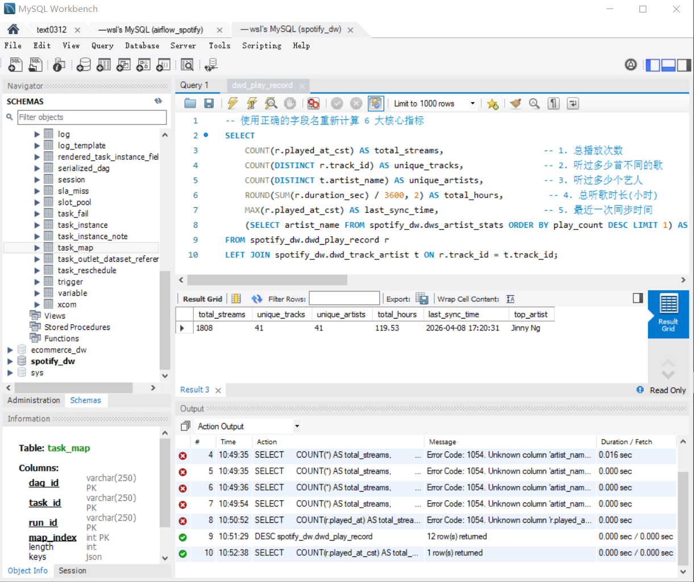
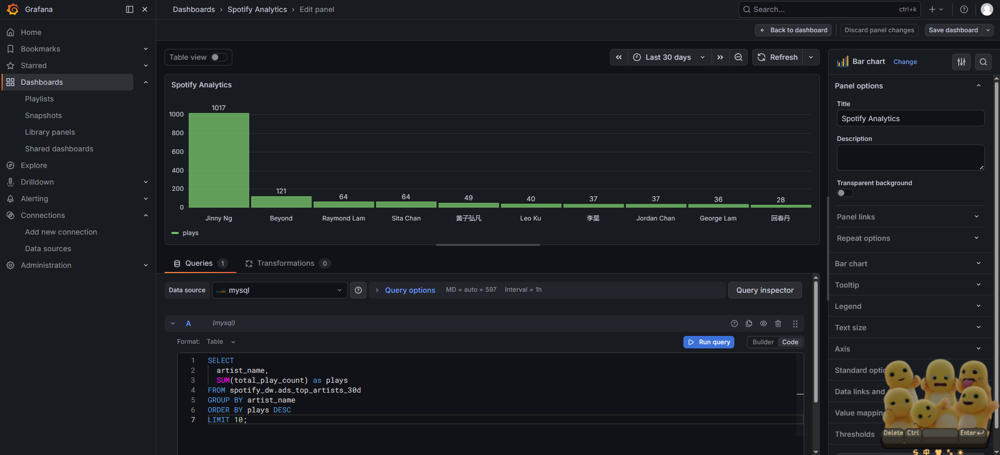
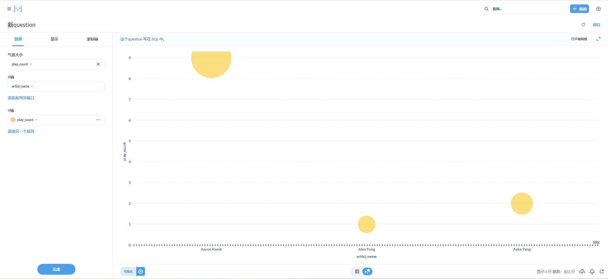
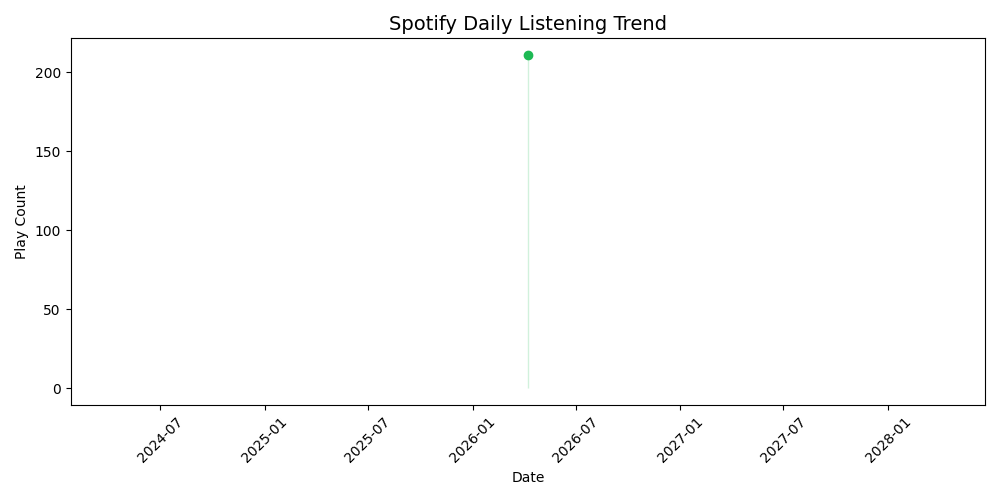

# Spotify Music Data Warehouse

> An end-to-end Data Engineering project built on the Spotify API. This project implements a complete data pipeline including API ingestion, 4-layer data warehouse modeling, automated orchestration, and interactive visualization dashboards.

## Architecture



**Data Flow:** Spotify API → ODS (Source) → DWD (Detail) → DWS (Summary) → ADS (Application) → Grafana / Metabase

## Tech Stack

| Module | Technologies |
|------|------|
| **Data Ingestion** | Python · Spotipy · OAuth2 · Incremental Watermark |
| **Data Storage** | MySQL 8.0 · 4-Layer Warehouse (ODS/DWD/DWS/ADS) |
| **Data Processing** | Pandas · SQLAlchemy · Data Quality Checks |
| **Orchestration** | Apache Airflow 2.8 · 8-node DAG |
| **Containerization** | Docker · Docker Compose |
| **Visualization** | Grafana · Metabase |

## Data Warehouse Design

| Layer | Description |
|------|------|
| **ODS** | **Operational Data Store**: Raw data landing zone. Retains all API fields without any business logic processing. |
| **DWD** | **Data Warehouse Detail**: Data cleansing, deduplication, UTC to Local Time conversion, JSON flattening, and `is_valid` flagging. |
| **DWS** | **Data Warehouse Service**: Aggregations by day, artist, or hour. Generates KPIs such as play count, duration, and popularity. |
| **ADS** | **Application Data Store**: Wide tables optimized for BI: Top Artists, Listening Trends, and Genre Distribution. |

## Airflow Orchestration (DAG)

The pipeline consists of 8 task nodes with defined dependencies and an auto-retry mechanism (max 2 retries).


**Task Chain:**
`check_api_health`
↓
`extract_play_history` ──→ `quality_check` ──→ `transform_load_dwd`
↓                                           ↓
`extract_track_details` ─────────────────→ `aggregate_dws`
↓                                           ↓
`extract_artist_details` ────────────────→ `build_ads`

**Core Design Features:**
- **Incremental Extraction:** Uses a watermark mechanism to fetch only new records, ensuring idempotency and preventing duplicates.
- **Data Quality Gates:** Pre-load checks for null rates (<5%), duplication (<1%), and value range validity to block anomalous data from downstream.
- **Efficient Communication:** Utilizes Airflow XComs to pass `track_id` and `artist_id` between tasks, minimizing unnecessary table lookups.

## Key Performance Indicators (KPIs)



| Metric | Value |
|------|------|
| **Total Plays** | 1,808 |
| **Unique Tracks** | 41 |
| **Unique Artists** | 41 |
| **Total Listening Time** | 119.53 Hours |
| **Last Sync Date** | 2026-04-08 |
| **Top Artist** | Jinny Ng |

## Visualizations

### Top Artists Ranking (Grafana)


### Artist Distribution (Metabase)


### Daily Listening Trends


## Quick Start

```bash
# 1. Clone the repository
git clone [https://github.com/Zaya-M/Spotify-ETL-Pipeline-Upgraded-Version.git](https://github.com/Zaya-M/Spotify-ETL-Pipeline-Upgraded-Version.git)
cd Spotify-ETL-Pipeline-Upgraded-Version

# 2. Configure Environment Variables
cp .env.example .env
# Edit .env and provide your Spotify Client ID/Secret and MySQL credentials

# 3. Spin up Services (MySQL + Airflow + Metabase)
docker-compose up -d

# 4. Access Airflow UI (Default: airflow/airflow)
open http://localhost:8080

# 5. Access Grafana Dashboard
open http://localhost:3000

Project Highlights
Idempotency: Implemented INSERT IGNORE combined with a watermark mechanism to ensure the ETL process is repeatable without data duplication.

Data Quality (DQ) First: Four critical checks (Nulls, Duplicates, Schema, and Row Counts) are executed before writing to DWD to ensure data integrity.

Professional Standards: Standardized logging module, .env configuration isolation, full Docker containerization, and conventional Git commit messages.

Observability: Dual-layer monitoring via Airflow task-level logs and Grafana business-level metrics.